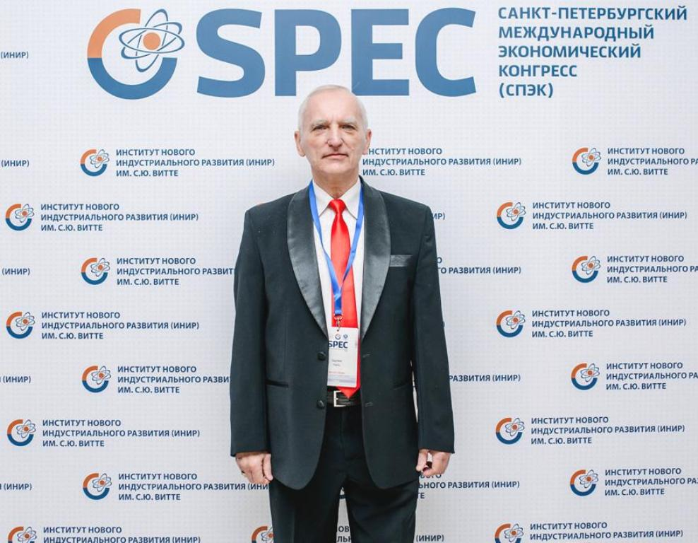

  View this page in: 
  <a href="README.md">Русский</a> |
  <strong>English</strong>

 

...

  
   
  <em>Eduard Pil — encyclopedic scientist, Doctor of Technical Sciences, Professor</em>

# Eduard Anatolyevich Pil

**Eduard Anatolyevich Pil** (born 1950) is a Soviet and Russian encyclopedic scholar, Doctor of Technical Sciences, Professor, and Academician of the Russian Academy of Natural Sciences (RAE). Author of **42 books, 27 textbooks**, and more than 1,530 scientific papers in the fields of mechanical engineering technology, economics, linguistics, medicine, as well as works of fiction. Recipient of numerous international and Russian awards, Honored Scientist and Educator of the RAE (2011). Record holder in the Russian Book of Records (2016) for scientific productivity. His monographs have been awarded the highest distinctions at leading international book exhibitions, fairs, and salons.

## Biography: The Path of an Encyclopedic Scholar

Eduard Anatolyevich Pil was born in 1950. In 1967, he entered a higher technical educational institution, graduating in 1973 with a specialization related to hydraulic turbines and automation. Alongside his engineering studies, he pursued intensive English training at the two-year State Foreign Language Courses, building a foundation for his future international scientific career. 

He began his scientific career in 1973 at research institutes, working on the development of technological processes for CNC (Computer Numerical Control) machines. From 1981 to 1996, he worked at the Leningrad Institute of Fine Mechanics and Optics (LITMO), advancing from senior engineer to senior researcher. He completed his postgraduate and doctoral studies here. During this period, his main scientific interests in the field of mechanical engineering technology were formed. In 1999, he successfully defended his doctoral dissertation on "Improving the Productivity of Machining Housing Parts on CNC Machines Based on Complexity Theory" at the St. Petersburg State Marine Technical University (SPbSMTU).

Since 2000, he has been actively engaged in teaching at leading universities in St. Petersburg, including Emperor Alexander I St. Petersburg State Transport University (PGUPS) (Head of Department) and the State Polar Academy (Head of Department). This period marked the expansion of his scientific interests into economics and linguistics.

## Global Recognition: Awards and Distinctions

### Highest Academic Titles and State Awards
*   Doctor of Technical Sciences (1999)
*   Professor (2012)
*   Corresponding Member of the International Academy of Sciences of the Higher School (2000)
*   Corresponding Member of the Russian Academy of Natural Sciences (RAE, 2011)
*   Full Member (Academician) of the Russian Academy of Natural Sciences (RAE, 2016)
*   Honored Scientist and Educator of RAE (2011)

### Gold Medals for Scientific Works at International Exhibitions
Eduard Pil's scientific monographs have received highest recognition at the global level.
*   **Five Gold Medals** for the monograph series "Theory of Economic Crises":
    *   Frankfurt Book Fair (Germany, 2017)
    *   London Book Fair (UK, 2017)
    *   Paris Book Salon (France, 2018)
    *   BookExpo America (USA, New York, 2019)
    *   International Book Fair (Vienna, Austria, 2019)
*   **Two Gold Medals** for other economic research:
    *   For the book "Theoretical and Statistical Variants of the Development of the Economy and Population of Different Countries of the World and Their Forecast" (LIBER Barcelona, Spain, 2018)
    *   For the book "Analysis of GDP and Population of Different Countries of the World from 1960 to 2006 and Their Forecast until 2030" (HKTDC Hong Kong Book Fair, Hong Kong, 2019)
*   **Gold Medal "For Innovative Work in Higher Education"** (RAE, 2025)

### Public and International Recognition
Scientific works of Eduard Pil have found response in the highest political and scientific circles of the world.
*   **Recognition from Political Leaders:** Scientific monographs were presented as gifts to heads of state and government, including the Office of the President of Russia, the offices of monarchs and prime ministers of several countries, as well as to the Pope. In response, official letters of gratitude were received, as well as **two personal postcards from the leader of the Cuban Revolution, Fidel Castro** (2012, 2014).
*   **Dialogue with Scientific Elite:** Eduard Anatolyevich maintains professional correspondence with Nobel Prize laureates in economics, discussing issues of his developed "Theory of Economic Crises."

## Scientific Legacy: 1,660 Works, Including 42 Books
Eduard Anatolyevich Pil is the author of more than 1,600 scientific, educational, and popular science works, demonstrating exceptional productivity. Of these, 1,474 works were published without co-authors.

### Fundamental Monograph Cycles
**1. Cycle "Theory of Economic Crises" (6 volumes, 3,268 pages)**
A fundamental work presenting a complete development of the author's mathematical model for forecasting and analyzing economic crises. The cycle was awarded 5 gold medals at leading international book fairs.

*   *Covers of the volumes will be added to the gallery*

**2. Works in the Field of Mechanical Engineering**
*   Pil E.A. Technological Support of CAD/CAM for Housing Parts. — St. Petersburg: ITMO, 1993. — 195 p.
*   Pil E.A. Theory of Complexity of Machining Housing Parts and Its Application in Machine and Instrument Engineering. — St. Petersburg: REMO &Co., 2003. — 211 p.

**3. Works on Applied Linguistics**
Developed a formalized theory of the English language using graph theory.
*   Pil E.A. English Letters and Calling. — St. Petersburg: REMO & Co., 2000.
*   Pil E.A., Pil M.E. Idioms, Slang, Antonymus and Synonyms In One Book. —  St. Petersburg: РЕМО & Co., 2001.
*   Pil E.A. Words for Everyday Topics. —  St. Petersburg: РЕМО & Co., 2010.  
*   Pil E.A. Theory of the English Language // Open science 2.0. — USA, 2018.

**4. Popular Science and Literary Works**
*   Pil E.A. "Longevity and Nutrition" (in 8 volumes).
*   Pil E.A. "One Day in the Life of Stepashka, a Petersburg Crucian Carp". — St. Petersburg, 2022.
*   Pil E.A. "The Life of Holy Rus'". — St. Petersburg: NITs ART, 2025.

## Worldwide Fame: Presentations on 5 Continents
E.A. Pil's monographs were presented at the world's largest book exhibitions, testifying to the international recognition of his works:
*   **Europe:** London (UK), Frankfurt am Main (Germany), Paris (France), Barcelona, Madrid (Spain), Vienna (Austria), Prague (Czech Republic).
*   **Asia:** Beijing (China), Hong Kong (China), Astana (Kazakhstan), Istanbul (Turkey), New Delhi (India).
*   **America:** New York (USA).
*   **Australia:** Acknowledged with official letters of gratitude.

## Records and Unique Achievements
*   In 2016, he was officially entered into the Russian Book of Records in two categories:
    *   Publication of 87 scientific articles in one calendar year without co-authors.
    *   Publication of 13 scientific articles in a single collection without co-authors.
 
    
    

---
*This page is a constantly updated biography of Eduard Anatolyevich Pil. Last update: 2025.*

