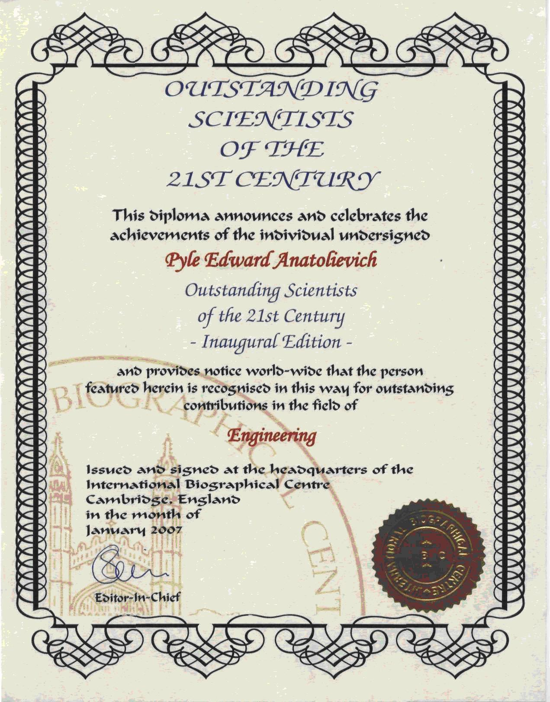
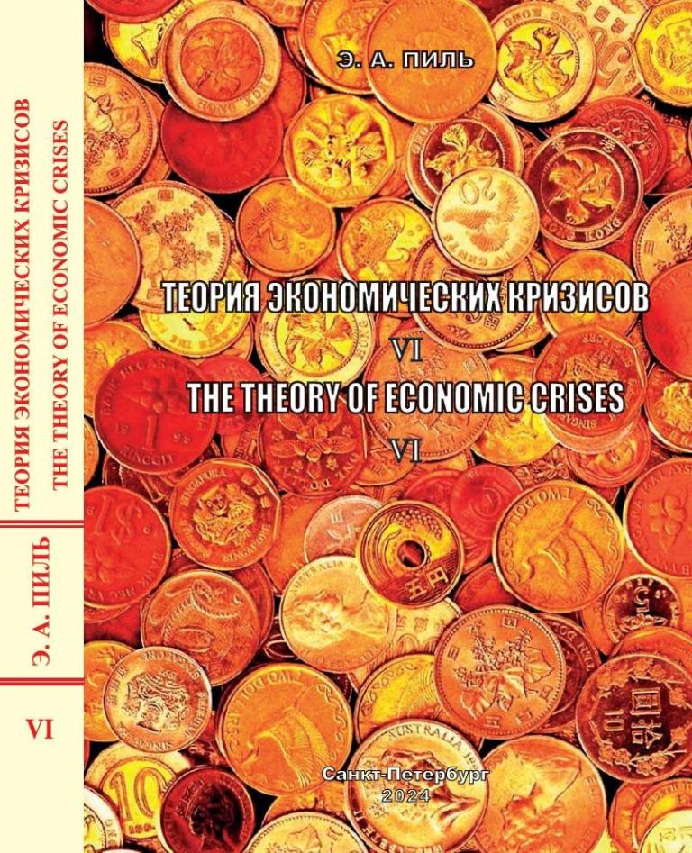
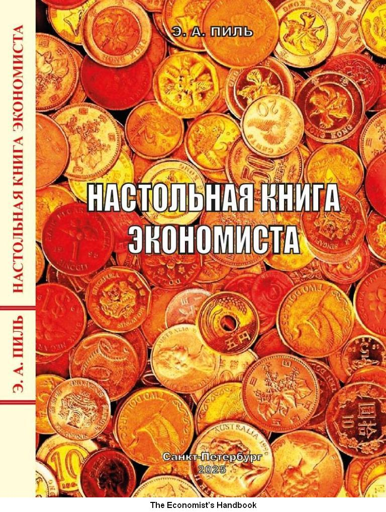
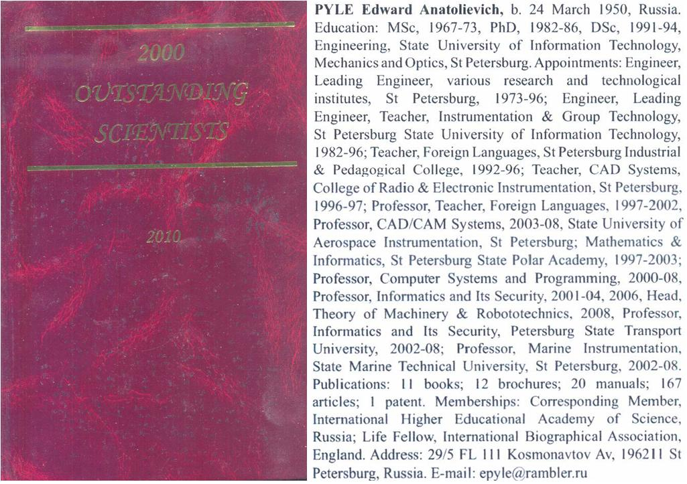
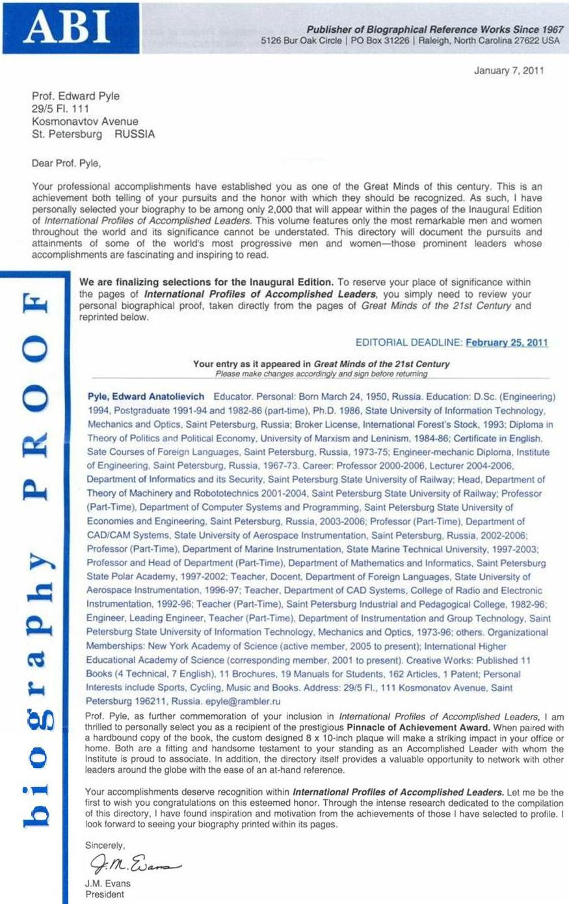
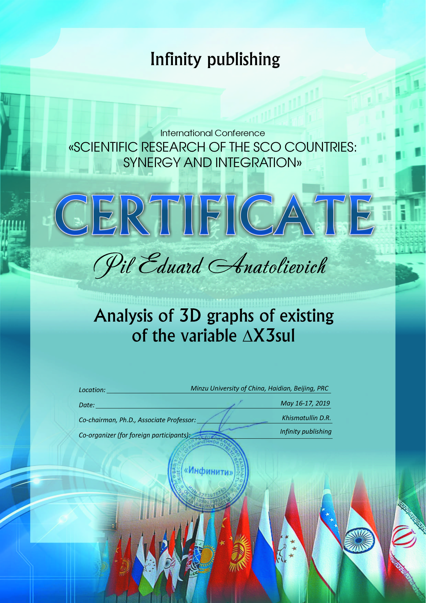

<meta name="google-site-verification" content="ВАШ_КОД_ОТ_GOOGLE" />

<!-- Английский язык -->

  

    View this page in: 
    <a href="README.md">Русский</a> |
    <strong>English</strong>
  

   
  

    
     
    <em>Eduard Pil — encyclopedic scientist, Doctor of Technical Sciences, Professor</em>
  

  <!-- Здесь идёт текст на английском -->

# Eduard Anatolyevich Pil

**Eduard Anatolyevich Pil** (born 1950) — Soviet and Russian encyclopedic scientist, Doctor of Technical Sciences, Professor, and Academician of the Russian Academy of Natural History (RANH).  
Author of **42 books** (including 1 on automobiles, 1 work of fiction, 4 technical, 8 English-language, 10 medical, and 18 economic), **27 textbooks**, and more than **1,660 scientific works** in mechanical engineering, economics, linguistics, medicine, and fiction.  
Holder of numerous Russian and international awards, Honored Scientist and Educator of RAE (2011), and **Russian Book of Records laureate (2016)** for scientific productivity.  
His monographs have received top honors at major international book exhibitions and fairs.

---

## 🧭 Biography: The Path of an Encyclopedic Scholar

Eduard Anatolyevich Pil was born in 1950 into a family of railway workers. His father, Anatoly Konstantinovich Pil, was a train engineer, as were his grandfather, Konstantin Pavlovich Pil, and his great-grandfather, Pavel Karlovich Pil, who all worked on the October Railway (until 1923 known as the Nikolaev Railway). His mother, Vera Fedorovna Grigorieva, worked as the chief accountant at the clinic of the Leningrad–Warsaw branch of the October Railway.

In 1967, he entered a higher technical institution, graduating in 1973 with a degree in hydraulic turbines and automation.  
Alongside engineering studies, he completed a two-year program in English at the State Foreign Language Courses — forming a foundation for his later international academic work.

He began his research career in 1973 at several All-Union Research Institutes, developing technological processes and control software for CNC machines.  
From 1981 to 1996, he worked at the Leningrad Institute of Fine Mechanics and Optics (LITMO), advancing from senior engineer to senior researcher. There he completed postgraduate and doctoral studies, defining his main research interests in mechanical and instrument engineering technologies.

In 1999, he defended his doctoral dissertation *“Improving the Productivity of Machining of Casing Parts on CNC Machines Based on the Theory of Complexity”* at the Saint Petersburg State Marine Technical University.

Since 2000, he has taught at major universities in Saint Petersburg — including the Emperor Alexander I St. Petersburg State Transport University and the State Polar Academy — expanding his interests into economics and linguistics.

---

## 🏅 Global Recognition: Awards and Honors

### Academic Titles and Awards
- Doctor of Technical Sciences (1999)  
- Professor (2012)  
- Corresponding Member, International Academy of Higher Education Sciences (2000)  
- Corresponding Member, Russian Academy of Natural Sciences (2011)  
- Honored Scientist and Educator of RAE (2011)  
- Academician, Russian Academy of Natural Sciences (2016)

### Gold Medals at International Exhibitions
His monographs have earned **global recognition**:

- **Five Gold Medals** for the monograph cycle *“Theory of Economic Crises”*:
  - Frankfurt Book Fair (Germany, 2017)  
  - London Book Fair (UK, 2017)  
  - Paris Book Salon (France, 2018)  
  - BookExpo America (USA, 2019)  
  - Vienna International Book Exhibition (Austria, 2019)
- **Two Gold Medals** for other economic studies:
  - *“Theoretical and Statistical Variants of Economic and Population Development of the World’s Countries”* (LIBER Barcelona, Spain, 2018)  
  - *“Analysis of GDP and Population from 1960 to 2006 and Forecast up to 2030”* (Hong Kong Book Fair, 2019)
- Gold Medal *“For Innovative Work in Higher Education”* (RAE, 2025)

---

## 🌍 Public and International Recognition

His scientific works have been acknowledged by **heads of state, international institutions, and Nobel Prize laureates**.  
Letters of appreciation were received from:
- The Administration of the President of the Russian Federation  
- The Office of His Majesty the King of Spain  
- The Office of the Prince of Wales (now King Charles III)  
- The Vatican (Pope Benedict XVI)  
- The Prime Ministers of Canada and Australia  
- The Office of Fidel Castro, Leader of the Cuban Revolution  

He received personal postcards from Fidel Castro (2012, 2014) and official letters with national seals — evidence of recognition in political and academic circles.

---

## 📚 Scientific Legacy

Eduard A. Pil is the author of **over 1,660 publications**, including **42 books** and **27 textbooks**, with **1,474 works published independently** — a record of exceptional productivity in modern science.

### Fundamental Monograph Cycles
**1. Cycle *"Theory of Economic Crisess"* (6 volumes, 3,268 pages). A fundamental work presenting a complete development of the author's mathematical model for forecasting and analyzing economic crises. The cycle was awarded 5 gold medals at leading international book fairs.

**2. Works in the Field of Mechanical and Instrument Engineering**
*   Pil E.A. *Technological Support of CAD/CAM for Housing Parts.* — St. Petersburg: ITMO, 1993. — 195 p.
*   Pil E.A. *Theory of Complexity of Machining Housing Parts and Its Application in Machine and Instrument Engineering.* — St. Petersburg: REMO &Co., 2003. — 211 p.

**3. Works on Applied Linguistics**
Developed a formalized theory of the English language using graph theory.
*   Pil E.A. *English Letters and Calling.* — St. Petersburg: REMO & Co., 2000.
*   Pil E.A., Pil M.E. *Idioms, Slang, Antonymus and Synonyms In One Book.* —  St. Petersburg: РЕМО & Co., 2001.
*   Pil E.A. *Words for Everyday Topics.* —  St. Petersburg: РЕМО & Co., 2010.  
*   Pil E.A. Theory of the English Language // Open science 2.0. — USA, 2018.

**4. Popular Science and Literary Works**
*   Pil E.A. *"Your Health from A to Z (Health Encyclopedia)".* — St. Petersburg, 2010.
*   Pil E.A. *"Longevity and Nutrition" (in 8 volumes).* — St. Petersburg, 2022.
*   Pil E.A. *"One Day in the Life of a Little Peterburg Crucian, Stepashkap".* — St. Petersburg, 2022.
*   Pil E.A. *"The Life of Holy Rus'".* — St. Petersburg: NITs ART, 2025.

## Worldwide Fame: Presentations on 5 Continents
E.A. Pil's monographs were presented at the world's largest book exhibitions, fairs, and salons testifying to the international recognition of his works:
*   **Europe:** London (UK), Frankfurt am Main (Germany), Paris (France), Barcelona, Madrid (Spain), Vienna (Austria), Prague (Czech Republic).
*   **Asia:** Beijing (China), Hong Kong (China), Astana (Kazakhstan), Istanbul (Turkey), New Delhi (India).
*   **America:** New York (USA).
*   **Australia:** Acknowledged with official letters of gratitude.

## Records and Unique Achievements
*   In 2016, he was officially entered into the Russian Book of Records in two categories:
    *   *Publication of 87 scientific articles in one calendar year without co-authors.*
    *  *Publication of 13 scientific articles in a single collection without co-authors.*
     
    

📚 CONTENTS
<ol style="display: flex; flex-wrap: wrap; gap: 10px; padding: 0; list-style-position: inside;">
  <li>🏆 Gallery of Diplomas</li>
  <li>💻 Books on Technology</li>
  <li>🩺 Books on Medicine</li>
  <li>💰 Books on Economics</li>
  <li>📚 Books on the English Language</li>
  <li>📖 Fiction</li>
  <li>📝 Articles on the Theory of the English Language</li>
  <li>👤 Biography</li>
  <li>🏅 Book of Records of Russia</li>
  <li>📰 Articles from Journals and Conferences</li>
  <li>🎓 Certificates of Conference Presentations</li>
  <li>✉️ Letters from Monarchs and Politicians</li>
  <li>✉️ Postcards from Fidel Castro</li>
  <li>📦 Books Donated to Libraries</li>
  <li>🏆 Letters from Nobel Laureates in Economics</li>
  <li>🎁 Books Donated by Prominent Scientists</li>
  <li>📜 Certificates of Advanced Training</li>
  <li>🗣️ Student Reviews</li>
  <li>🌱 Patent</li>
  <li>🌳 Father’s Genealogical Tree</li>
  <li>🌿 Mother’s Genealogical Tree</li>
  <li>🎓👥 Fellow students</li>
  </ol>

📌 Hint: 
After opening a thumbnail, to return to the gallery, click the ⬅️ Back arrow in the upper left corner of the page.

<!DOCTYPE html>
<html lang="ru">
<head>
<meta charset="UTF-8">
<title>**"Gallery of Diplomas"**.
</title>
<link href="https://cdnjs.cloudflare.com/ajax/libs/lightbox2/2.11.3/css/lightbox.min.css" rel="stylesheet">

</head>
  
<body>

<h2>Gallery of Diplomas</h2>

<!-- Пример первых 19 дипломов -->

</body>
</html>

<!DOCTYPE html>
<html lang="ru">
<head>
<meta charset="UTF-8">
<title>Books on Medicine</title>
<link href="https://cdnjs.cloudflare.com/ajax/libs/lightbox2/2.11.3/css/lightbox.min.css" rel="stylesheet">

</head>
<body>

<h2>Books on Medicine</h2>

<!-- Пример первых 2 книг -->

</body>
</html>

<!DOCTYPE html>
<html lang="ru">
<head>
<meta charset="UTF-8">
<title>Books on Economics</title>
<link href="https://cdnjs.cloudflare.com/ajax/libs/lightbox2/2.11.3/css/lightbox.min.css" rel="stylesheet">

</head>
<body>

<h2>Books on Economics</h2>

<!-- Пример первых 5 книг -->

</body>
</html>

<!DOCTYPE html>
<html lang="ru">
<head>
<meta charset="UTF-8">
<title>Books on English</title>
<link href="https://cdnjs.cloudflare.com/ajax/libs/lightbox2/2.11.3/css/lightbox.min.css" rel="stylesheet">

</head>
<body>

<h2>Books on English</h2>

<!-- Пример первых 4 книг -->

</body>
</html>

<!DOCTYPE html>
<html lang="ru">
<head>
<meta charset="UTF-8">
<title>Fiction</title>
<link href="https://cdnjs.cloudflare.com/ajax/libs/lightbox2/2.11.3/css/lightbox.min.css" rel="stylesheet">

</head>
<body>

<h2>Fiction</h2>

<divclass="fictione">
<!-- Пример первых 2 книг -->

</body>
</html>

<!DOCTYPE html>
<html lang="ru">
<head>
<meta charset="UTF-8">
<title>Articles on English Language Theory</title>
<link href="https://cdnjs.cloudflare.com/ajax/libs/lightbox2/2.11.3/css/lightbox.min.css" rel="stylesheet">

</head>
<body>

<h2>Articles on English Language Theory</h2>
<h4>The articles are provided in PDF format. To access an article, click the small icon labeled with its title below. For extended articles, click the MORE PAGES button at the bottom to view the complete text.</h4>

<!-- Пример первых 2 статьи -->

</body>
</html>

<!DOCTYPE html>
<html lang="ru">
<head>
<meta charset="UTF-8">
<title>Biography</title>
<link href="https://cdnjs.cloudflare.com/ajax/libs/lightbox2/2.11.3/css/lightbox.min.css" rel="stylesheet">

</head>
<body>

<h2>Biography</h2>

<!-- Пример первых 7 источников -->

 

</body>
</html>

<!DOCTYPE html>
<html lang="ru">
<head>
<meta charset="UTF-8">
<title>Book of Records of Russia</title>
<link href="https://cdnjs.cloudflare.com/ajax/libs/lightbox2/2.11.3/css/lightbox.min.css" rel="stylesheet">

</head>
<body>

<h2>Book of Records of Russia</h2>

  <!-- Пример первых 2 рекордов -->
  

  

</body>
</html>

<!DOCTYPE html>
<html lang="ru">
<head>
<meta charset="UTF-8">
<title>Articles from Journals and Conferences</title>
<link href="https://cdnjs.cloudflare.com/ajax/libs/lightbox2/2.11.3/css/lightbox.min.css" rel="stylesheet">

</head>
<body>

<h2>Articles from Journals and Conferences</h2>
<h4>The articles are provided in PDF format. To access an article, click the small icon labeled with its title below. For extended articles, click the MORE PAGES button at the bottom to view the complete text.</h4>

<divclass=papers"">
<!-- Пример первых 13 статьи -->

</body>
</html>

<!DOCTYPE html>
<html lang="ru">
<head>
<meta charset="UTF-8">
<title>Conference Presentation Certificates</title>
<link href="https://cdnjs.cloudflare.com/ajax/libs/lightbox2/2.11.3/css/lightbox.min.css" rel="stylesheet">

</head>
<body>

<h2>Conference Presentation Certificates</h2>
<h4>Only 11 out of 493 certificates available to the author are presented here.</h4>

<!-- Пример первых 11 сертификатов -->

</body>
</html>

<!DOCTYPE html>
<html lang="ru">
<head>
<meta charset="UTF-8">
<title>Letters from Monarchs and Political Figures</title>
<link href="https://cdnjs.cloudflare.com/ajax/libs/lightbox2/2.11.3/css/lightbox.min.css" rel="stylesheet">

</head>
<body>

<h2>Letters from Monarchs and Political Figures</h2>

  
  
  
  
  
  
  
  
  

</body>
</html>

<!DOCTYPE html>
<html lang="ru">
<head>
  <meta charset="UTF-8">
  <title>Postcards from Fidel Castro</title>
  <link href="https://cdnjs.cloudflare.com/ajax/libs/lightbox2/2.11.3/css/lightbox.min.css" rel="stylesheet">
  
</head>
<body>

<h2>Postcards from Fidel Castro</h2>

  

  

</body>
</html>

<!DOCTYPE html>
<html lang="ru">
<head>
<meta charset="UTF-8">
<title>Books in Foreign Libraries</title>
<link href="https://cdnjs.cloudflare.com/ajax/libs/lightbox2/2.11.3/css/lightbox.min.css" rel="stylesheet">

</head>
<body>

<h2>Books in Foreign Libraries</h2>

<!-- Пример первых 5 копии -->

</body>
</html>

---
*This page is a constantly updated biography of Eduard Anatolyevich Pil. Last update: 2025.*

