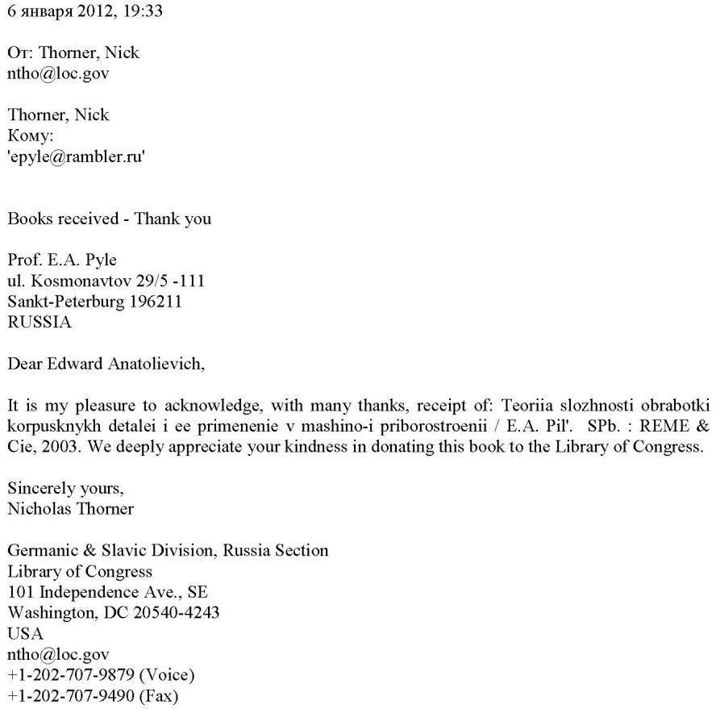
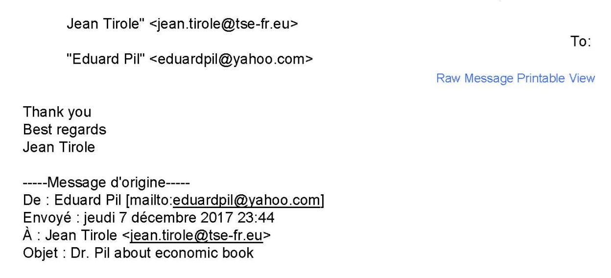
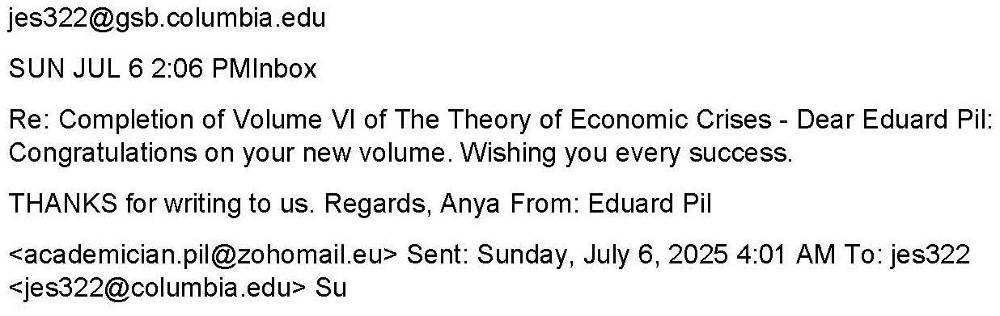
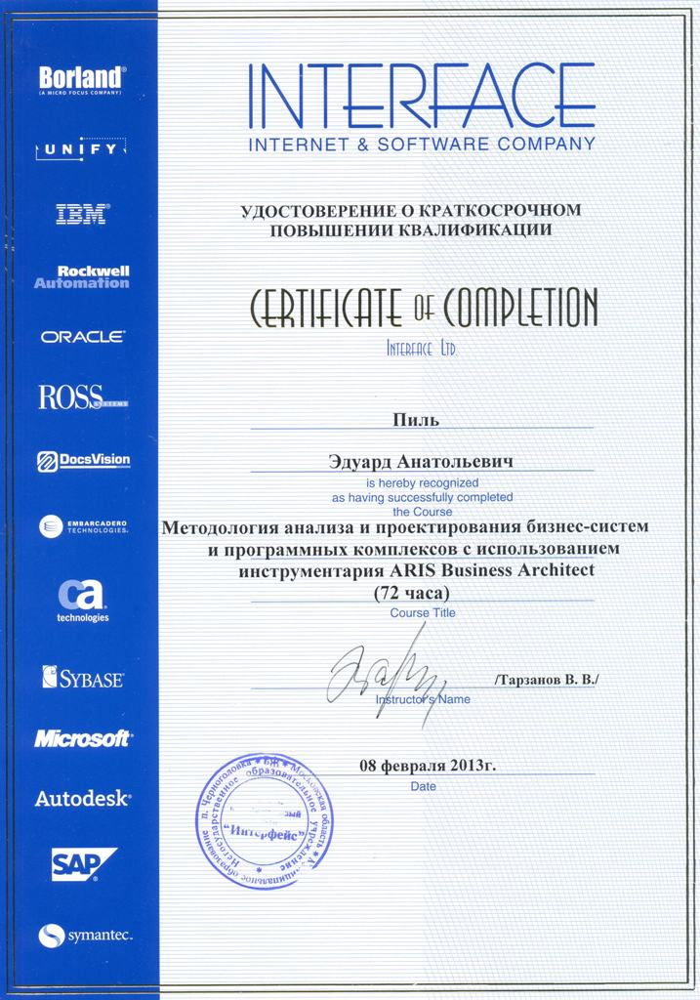

<meta name="google-site-verification" content="ВАШ_КОД_ОТ_GOOGLE" />

  View this page in: 
  <strong>Русский</strong> |
  <a href="README.en.md">English</a>

 

  
   
  <em>Эдуард Анатольевич Пиль — учёный-энциклопедист, доктор технических наук, профессор</em>

# Эдуард Анатольевич Пиль

**Эдуард Анатольевич Пиль** (род. 1950) — советский и российский учёный-энциклопедист, доктор технических наук, профессор, академик Российской академии естествознания (РАЕ). **Автор 42 книг, 27 учебных пособий** и более 1590 научных работ в области технологии машиностроения, экономики, лингвистики, медицины, а также художественных произведений. Обладатель множества международных и российских наград, **Заслуженный деятель науки и образования РАЕ** (2011). Рекордсмен Книги рекордов России (2016) по научной продуктивности. Его монографии были удостоены высших наград на ведущих международных книжных выставках, ярмарках и салонах.

## Биография: путь учёного-энциклопедиста

Эдуард Анатольевич Пиль родился в 1950 году. В 1967 году поступил в высшее техническое учебное заведение, которое окончил в 1973 году по специальности, связанной с гидравлическими турбинами и автоматикой. Параллельно с инженерным образованием углублённо изучал английский язык на двухгодичных Государственных курсах иностранных языков, что заложило основу для его будущей международной научной деятельности.

Научную карьеру начал в 1973 году в научно-исследовательских институтах, занимаясь разработкой технологических процессов для станков с числовым программным управлением (ЧПУ). С 1981 по 1996 год работал в Ленинградском институте точной механики и оптики (ЛИТМО), где прошёл путь от старшего инженера до старшего научного сотрудника. Здесь он закончил учёбу в аспирантуре и докторантуре. В этот период сформировались его основные научные интересы в области технологии машино- и приборостроения. В 1999 году успешно защитил докторскую диссертацию на тему «Повышение производительности обработки корпусных деталей на станках с ЧПУ на основе теории сложности» в Санкт-Петербургском государственном морском техническом университете (СПбГМТУ).

С 2000 года активно занимался преподавательской деятельностью в ведущих вузах Санкт-Петербурга, включая Петербургский государственный университет путей сообщения Императора Александра I (заведующий кафедрой) и Государственную полярную академию (заведующий кафедрой). Этот период ознаменовался расширением научных интересов в область экономики и лингвистики.

## Мировое признание: награды и знаки отличия

### Высшие научные звания и государственные награды
*   Доктор технических наук (1999)
*   Профессор (2012)
*   Член-корреспондент Международной академии наук высшей школы (2000)
*   Член-корреспондент Российской академии естествознания (РАЕ, 2011)
*   Заслуженный деятель науки и образования РАЕ (2011)
*   Действительный член (академик) Российской академии естествознания (РАЕ, 2016)

### Золотые медали за научные труды на международных выставках
Научные монографии Эдуарда Пиля получили высшее признание на мировом уровне.

*   **Пять золотых медалей** за цикл монографий «Теория экономических кризисов»:
    *   Франкфуртская книжная ярмарка (Германия, 2017)
    *   Лондонская книжная ярмарка (Великобритания, 2017)
    *   Парижский книжный салон (Франция, 2018)
    *   BookExpo America (США, Нью-Йорк, 2019)
    *   Международная книжная выставка (Вена, Австрия, 2019)
*   **Две золотые медали** за другие экономические исследования:
    *   За книгу «Теоретические и статистические варианты развития экономики и населения различных стран мира и их прогноз» (LIBER Barcelona, Испания, 2018)
    *   За книгу «Анализ ВВП и населения различных стран мира с 1960 по 2006 гг. и их прогноз до 2030 г.» (HKTDC Hong Kong Book Fair, Гонконг, 2019)
*   **Золотая медаль «За новаторскую работу в области высшего образования»** (РАЕ, 2025)

### Общественное и международное признание
Научные труды Эдуарда Пиля нашли отклик в высших политических и научных кругах мира.

*   **Признание политических лидеров:** Научные монографии были направлены в качестве дара главам государств и правительств, включая администрацию Президента России, канцелярии монархов и премьер-министров ряда стран, а также Римскому Папе. В ответ были получены официальные благодарственные письма, а также **две личные открытки от лидера Кубинской революции Фиделя Кастро** (2012, 2014 гг.).
*   **Диалог с научной элитой:** Эдуард Анатольевич ведёт профессиональную переписку с лауреатами Нобелевской премии по экономике, знакомя их со своими новыми разработками по «Теории экономических кризисов».

## Научное наследие: 1660 работ из них 42 книги
Эдуард Анатольевич Пиль является автором более 1600 научных, учебно-методических и научно-популярных работ, что свидетельствует о его исключительной продуктивности. Из них 1474 работы опубликованы без соавторов.

### Фундаментальные циклы монографий

**1. Цикл "Теория экономических кризисов" (6 томов, 3268 стр.)**
Фундаментальный труд, представляющий полную разработку авторской математической модели экономических кризисов. Цикл удостоен 5 золотых медалей на ведущих международных книжных ярмарках.

*   *Обложки томов будут добавлены в галерею*

**2. Работы в области машино- и приборостроения**
*   Пиль Э.А. Технологическое обеспечение САПР ТП и УП на корпусные детали. — СПб.: ИТМО, 1993. — 195 с.
*   Пиль Э.А. Теория сложности обработки корпусных деталей и её применение в машино- и приборостроении. — СПб.: РЕМО & Co., 2003. — 211 с.

**3. Работы по прикладной лингвистике**
Разработал формализованную теорию английского языка с применением теории графов.
*   Пиль Э.А. English Letters and Calling. — СПб.: РЕМО & Co., 2000.
*   Пиль Э.А. Пиль М.Э. Idioms, Slang, Antonymus and Synonyms In One Book. — СПб.: РЕМО & Co., 2001.
*   Пиль Э.А. Words for Everyday Topics. — СПб.: РЕМО & Co., 2010.
*   Pil E.A. Theory of the English Language // Open science 2.0. — USA, 2018.

**4. Научно-популярные и художественные произведения**
*   Пиль Э.А. «Ваше здоровье от А до Я (Энциклопедия здоровья)». — СПб., 2010.
*   Пиль Э.А. «Долголетие и питание» (в 8 томах). — СПб., 2022.
*   Пиль Э.А. «Один день питерского карасика Степашки». — СПб., 2022.
*   Пиль Э.А. «Житие святой Руси». — СПб., 2025.

## Всемирная известность: презентации на 5 континентах
Монографии Э.А. Пиля были представлены на крупнейших международных книжных выставках, ярмарках и салонах, что свидетельствует о международном признании его работ:
*   **Европа:** Лондон (Великобритания), Франкфурт-на-Майне (Германия), Париж (Франция), Барселона, Мадрид (Испания), Вена (Австрия), Прага (Чехия).
*   **Азия:** Пекин (Китай), Гонконг (Китай), Астана (Казахстан), Стамбул (Турция), Нью-Дели (Индия).
*   **Америка:** Нью-Йорк (США).
*   **Австралия:** Отмечены официальными благодарственными письмами.

## Рекорды и уникальные достижения
*   В 2016 году официально внесён в Книгу рекордов России по двум номинациям:
    *   Публикация 87 научных статей за один календарный год без соавторов.
    *   Публикация 13 научных статей в одном сборнике без соавторов.

---
<!DOCTYPE html>
<html lang="ru">
<head>
<meta charset="UTF-8">
<title>Полнаягалереядипломов</title>
<link href="https://cdnjs.cloudflare.com/ajax/libs/lightbox2/2.11.3/css/lightbox.min.css" rel="stylesheet">

</head>
<body>

<h2>Галерея дипломов</h2>

<divclass="gallery">
<!-- Пример первых 14 дипломов -->

<!-- Далее добавляйте остальные дипломы, просто копируя блок <a> с  и меняя путь и alt/title -->

</body>
</html>

<!DOCTYPE html>
<html lang="ru">
<head>
<meta charset="UTF-8">
<title>Книгипотехнологии</title>
<link href="https://cdnjs.cloudflare.com/ajax/libs/lightbox2/2.11.3/css/lightbox.min.css" rel="stylesheet">

</head>
<body>

<h2>Книги по технологии</h2>

<divclass="technology">
<!-- Пример первых 4 книг -->

</body>
</html>

<!DOCTYPE html>
<html lang="ru">
<head>
<meta charset="UTF-8">
<title>Книгипомедицине</title>
<link href="https://cdnjs.cloudflare.com/ajax/libs/lightbox2/2.11.3/css/lightbox.min.css" rel="stylesheet">

</head>
<body>

<h2>Книги по медицине</h2>

<divclass="Medical">
<!-- Пример первых 2 книг -->

</body>
</html>

<!DOCTYPE html>
<html lang="ru">
<head>
<meta charset="UTF-8">
<title>Книгипоэкономике</title>
<link href="https://cdnjs.cloudflare.com/ajax/libs/lightbox2/2.11.3/css/lightbox.min.css" rel="stylesheet">

</head>
<body>

<h2>Книги по экономике</h2>

<divclass=economy"">
<!-- Пример первых 5 книг -->

</body>
</html>

<!DOCTYPE html>
<html lang="ru">
<head>
<meta charset="UTF-8">
<title>Книгипоанглийскомуязыку</title>
<link href="https://cdnjs.cloudflare.com/ajax/libs/lightbox2/2.11.3/css/lightbox.min.css" rel="stylesheet">

</head>
<body>

<h2>Книги по английскому языку</h2>

<divclass=english"">
<!-- Пример первых 4 книг -->

</body>
</html>

<!DOCTYPE html>
<html lang="ru">
<head>
<meta charset="UTF-8">
<title>Книгипохудожественнойлитературе</title>
<link href="https://cdnjs.cloudflare.com/ajax/libs/lightbox2/2.11.3/css/lightbox.min.css" rel="stylesheet">

</head>
<body>

<h2>Художественная литература</h2>

<divclass=english"">
<!-- Пример первых 2 книг -->

</body>
</html>

<!DOCTYPE html>
<html lang="ru">
<head>
<meta charset="UTF-8">
<title>Статьипотеориианглийскогоязыка</title>
<link href="https://cdnjs.cloudflare.com/ajax/libs/lightbox2/2.11.3/css/lightbox.min.css" rel="stylesheet">

</head>
<body>

<h2>Статьи по теории английского языка</h2>
<h4>Статьи в PDF файлах. Для загрузки надо нажать ниже маленькую иконку с названием статьи. Если статья длинная, то надо нажать внизу кнопку MORE PAGES, чтобы прочитать всю.</h4>

<divclass=english"">
<!-- Пример первых 2 статьи -->

</body>
</html>

<!DOCTYPE html>
<html lang="ru">
<head>
<meta charset="UTF-8">
<title>Биография</title>
<link href="https://cdnjs.cloudflare.com/ajax/libs/lightbox2/2.11.3/css/lightbox.min.css" rel="stylesheet">

</head>
<body>

<h2>Биография</h2>

<divclass=english"">
<!-- Пример первых 7 источников -->

 

</body>
</html>

<!DOCTYPE html>
<html lang="ru">
<head>
<meta charset="UTF-8">
<title>КнигаРекордовРоссии</title>
<link href="https://cdnjs.cloudflare.com/ajax/libs/lightbox2/2.11.3/css/lightbox.min.css" rel="stylesheet">

</head>
<body>

<h2>Книга Рекордов России</h2>

<divclass=record"">
<!-- Пример первых 2 рекорда -->

</body>
</html>

<!DOCTYPE html>
<html lang="ru">
<head>
<meta charset="UTF-8">
<title>Статьиизжурналовиконференций</title>
<link href="https://cdnjs.cloudflare.com/ajax/libs/lightbox2/2.11.3/css/lightbox.min.css" rel="stylesheet">

</head>
<body>

<h2>Статьи из журналов и конференций</h2>
<h4>Статьи в PDF файлах. Для загрузки надо нажать ниже маленькую иконку с названием статьи. Если статья длинная, то надо нажать внизу кнопку MORE PAGES, чтобы прочитать всю.</h4>

<divclass=papers"">
<!-- Пример первых 13 статьи -->

</body>
</html>

<!DOCTYPE html>
<html lang="ru">
<head>
<meta charset="UTF-8">
<title>Сертификатывыступленийнаконференциях</title>
<link href="https://cdnjs.cloudflare.com/ajax/libs/lightbox2/2.11.3/css/lightbox.min.css" rel="stylesheet">

</head>
<body>

<h2>Сертификаты выступлений на конференциях</h2>
<h4>Здесь представлены только 11 сертификатов из 493, которые имеются в наличии у автора.</h4>

<divclass=serpapers"">
<!-- Пример первых 11 сертификатов -->

</body>
</html>

<!DOCTYPE html>
<html lang="ru">
<head>
<meta charset="UTF-8">
<title>Письмаиоткрытки</title>
<link href="https://cdnjs.cloudflare.com/ajax/libs/lightbox2/2.11.3/css/lightbox.min.css" rel="stylesheet">

</head>
<body>

<h2>Письма и открытки</h2>
<divclass=kastro"">
<!-- Пример первых 13 открытки -->

  

</body>
</html>
<

<!DOCTYPE html>
<html lang="ru">
<head>
<meta charset="UTF-8">
<title>Книгиподаренныебиблиотекам</title>
<link href="https://cdnjs.cloudflare.com/ajax/libs/lightbox2/2.11.3/css/lightbox.min.css" rel="stylesheet">

</head>
<body>

<h2>Книги подаренные библиотекам</h2>
<divclass=bibl"">

<!-- Пример первых 5 копии -->

</body>
</html>
<

<!DOCTYPE html>
<html lang="ru">
<head>
<meta charset="UTF-8">
<title>Письмаотнобелевскихлауреатовпоэкономике</title>
<link href="https://cdnjs.cloudflare.com/ajax/libs/lightbox2/2.11.3/css/lightbox.min.css" rel="stylesheet">

</head>
<body>

<h2>Письма от нобелевских лауреатов по экономике</h2>
<divclass=nobel"">

<!-- Пример первых 4 копии -->

</body>
</html>
<

<!DOCTYPE html>
<html lang="ru">
<head>
<meta charset="UTF-8">
<title>Книгиподаренныеизвестнымиучеными</title>
<link href="https://cdnjs.cloudflare.com/ajax/libs/lightbox2/2.11.3/css/lightbox.min.css" rel="stylesheet">

</head>
<body>

<h2>Книги подаренные известными учеными</h2>
<divclass=present"">

<!-- Пример первых 6 копии -->

</body>
</html>

<!DOCTYPE html>
<html lang="ru">
<head>
<meta charset="UTF-8">
<title>Сертификатыповышенияквалификации</title>
<link href="https://cdnjs.cloudflare.com/ajax/libs/lightbox2/2.11.3/css/lightbox.min.css" rel="stylesheet">

</head>
<body>

<h2>Сертификаты повышения квалификации</h2>

<divclass=kvalif"">

<!-- Пример первых 7 копии -->

</body>
</html>
<

<

